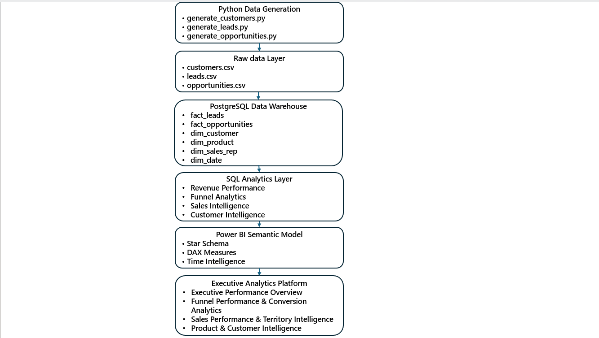
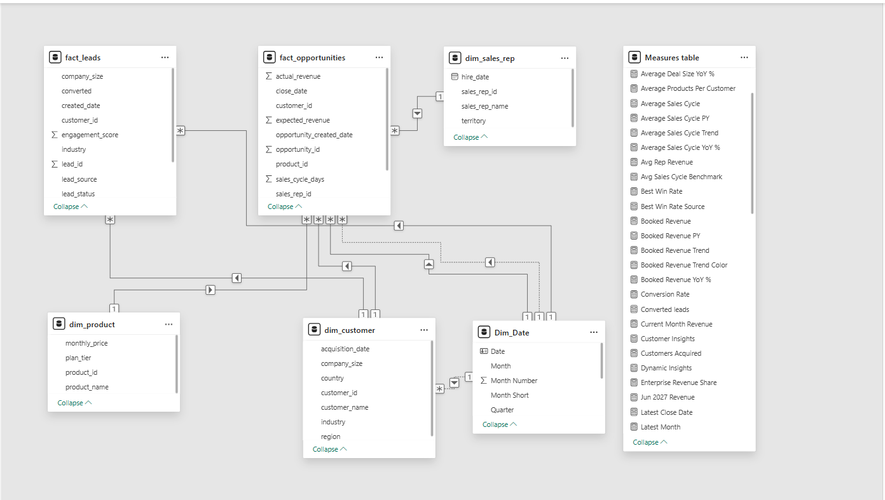
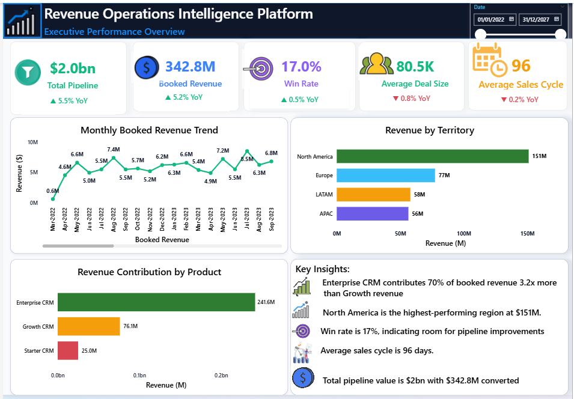
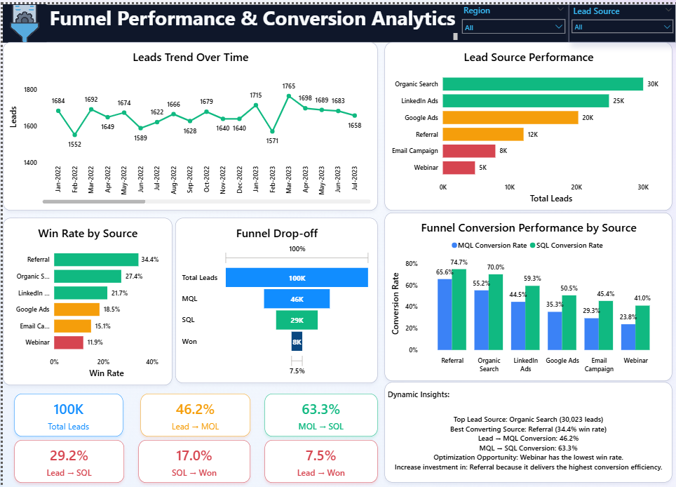
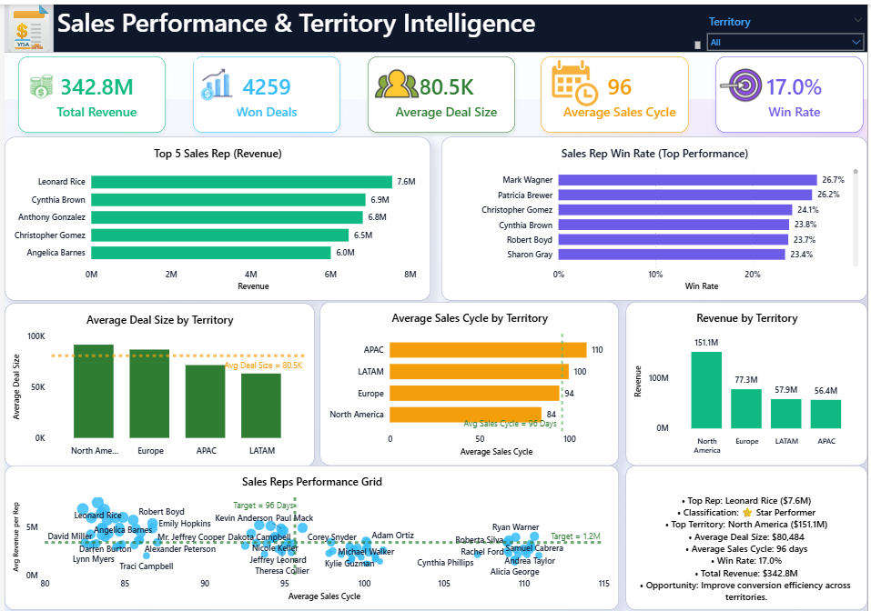
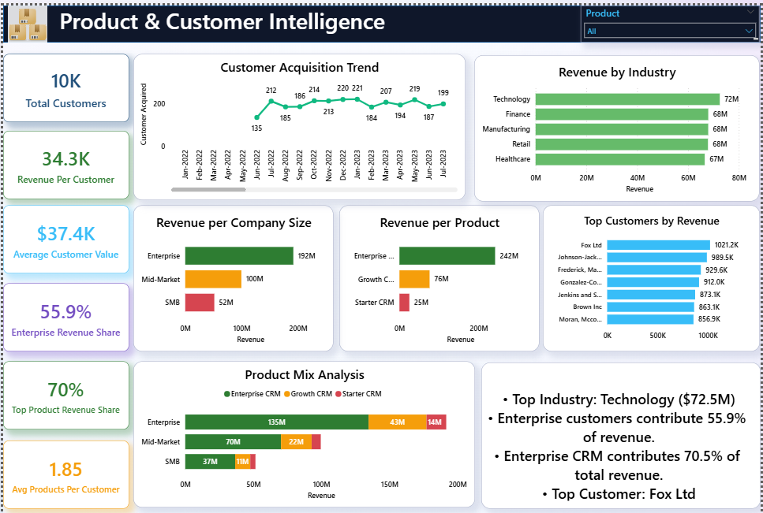

# 🚀 Revenue Operations Intelligence Platform

## 📌 Project Highlights

- 📈 100,000 Leads Analyzed
- 🎯 25,000 Opportunities Evaluated
- 👥 10,000 Customers Modeled
- 💰 $2.0B Revenue Pipeline
- 🏆 $342.8M Revenue Generated
- 📊 4 Executive Dashboards
- ⚡ PostgreSQL Data Warehouse
- 📈 Power BI Executive Analytics Platform


</p>

---

# 📖 Executive Summary

The **Revenue Operations Intelligence Platform** is an end-to-end analytics solution designed to provide complete visibility across the revenue lifecycle—from lead acquisition and pipeline creation to sales performance, customer value, and product contribution.

Built using **Python, PostgreSQL, SQL, and Power BI**, this project simulates a modern Revenue Operations (RevOps) environment by integrating Marketing, Sales, and Customer Intelligence into a unified analytics platform.

The solution enables executives to:

✅ Monitor pipeline health and revenue growth

✅ Analyze funnel conversion efficiency

✅ Evaluate sales rep and territory performance

✅ Understand customer profitability

✅ Assess product contribution to revenue

✅ Support data-driven revenue decisions

---

# 🎯 Business Impact

The Revenue Operations Intelligence Platform provides a single source of truth across Marketing, Sales, and Customer Intelligence.

The solution enables revenue leaders to:

- Identify funnel leakage across the Lead → MQL → SQL → Won lifecycle
- Evaluate sales rep productivity and conversion effectiveness
- Benchmark territory-level performance
- Understand customer and product revenue concentration
- Monitor executive KPIs through interactive dashboards

## Outcomes Delivered

| Metric | Value |
|---------|---------:|
| Leads Analyzed | 100,000 |
| Opportunities Evaluated | 25,000 |
| Customers Modeled | 10,000 |
| Revenue Pipeline | $2.0B |
| Revenue Generated | $342.8M |
| Win Rate | 17.0% |

---

# 🎯 Business Problem

Revenue organizations often struggle with fragmented reporting across Marketing, Sales, and Customer Success teams.

Common challenges include:

- Limited visibility into funnel conversion performance
- Difficulty identifying top-performing territories
- Lack of customer profitability insights
- Disconnected pipeline and sales reporting
- Inability to quickly identify revenue growth opportunities

This project solves these challenges through a centralized Revenue Operations Intelligence Platform.

---

# 🏗️ Solution Architecture

<p align="center">
  
</p>

### Architecture Flow

```text
Python Data Generation
        ↓
Raw CSV Files
        ↓
PostgreSQL Data Warehouse
        ↓
SQL Analytics Layer
        ↓
Power BI Semantic Model
        ↓
Executive Analytics Platform
```

# 🗄️ Data Model

<p align="center">
  
</p>

The platform follows a Star Schema design optimized for analytical reporting and time intelligence calculations.

### Fact Tables

| Table | Purpose |
|---------|---------|
| fact_leads | Lead generation and funnel activity |
| fact_opportunities | Revenue and pipeline tracking |

### Dimension Tables

| Table | Purpose |
|---------|---------|
| dim_customer | Customer attributes |
| dim_product | Product catalog |
| dim_sales_rep | Sales representative information |
| dim_date | Time intelligence and reporting calendar |

### Model Design Principles

- Star Schema architecture
- Single-direction filtering
- Optimized DAX performance
- Time intelligence enabled
- Scalable analytical structure

---

# ⚙️ Technology Stack

| Layer | Technology |
|---------|---------|
| Data Generation | Python |
| Data Storage | CSV |
| Data Warehouse | PostgreSQL |
| Data Modeling | Star Schema |
| Analytics Layer | SQL |
| BI & Visualization | Power BI |
| Business Logic | DAX |
| Time Intelligence | DAX Calendar Table |

---

# 🛠 Skills Demonstrated

### Revenue Operations

- Revenue Analytics
- Funnel Performance Analysis
- Pipeline Management
- Conversion Optimization
- Territory Performance

### Business Intelligence

- Executive KPI Reporting
- Dashboard Development
- Data Visualization
- Insight Generation

### Data Engineering

- ETL Development
- PostgreSQL
- SQL Analytics
- Data Warehousing
- Dimensional Modeling

### Power BI

- DAX
- Time Intelligence
- Star Schema Design
- Dynamic Insights
- Performance Optimization

---

# 🧠 Analytics Framework

The platform is structured into four executive dashboards:

| Dashboard | Purpose |
|------------|---------|
| Executive Overview | Revenue health monitoring |
| Funnel Analytics | Conversion optimization |
| Sales Intelligence | Territory & rep performance |
| Customer Intelligence | Product and customer analytics |

---

# 📊 Dashboard 1 — Executive Performance Overview

<p align="center">
  
</p>

## Key KPIs

💰 Total Pipeline

💵 Booked Revenue

🎯 Win Rate

👥 Average Deal Size

📅 Average Sales Cycle

## Business Insights

- Enterprise CRM contributes approximately **70% of booked revenue**
- North America generates the highest revenue contribution
- Win rate indicates opportunity for conversion optimization
- Pipeline exceeds **$2 Billion**
- Revenue exceeds **$342 Million**

---

# 🔄 Dashboard 2 — Funnel Performance & Conversion Analytics

<p align="center">
  
</p>

## Key KPIs

📈 Total Leads

🎯 Lead → MQL Conversion

🔄 MQL → SQL Conversion

🏆 SQL → Won Conversion

## Business Insights

- Referral leads deliver the highest win rate
- Organic Search drives the highest lead volume
- Webinar leads underperform relative to other sources
- Funnel leakage opportunities identified between Lead and SQL stages

---

# 🏆 Dashboard 3 — Sales Performance & Territory Intelligence

<p align="center">
  
</p>

## Key KPIs

💰 Total Revenue

🏅 Won Deals

👥 Average Deal Size

📅 Average Sales Cycle

🎯 Win Rate

## Business Insights

- North America is the highest-performing territory
- Leonard Rice is the top revenue-producing sales representative
- Average deal size exceeds **$80K**
- Sales cycle averages **96 days**
- Territory performance varies significantly across regions

---

# 👥 Dashboard 4 — Product & Customer Intelligence

<p align="center">
  
</p>

## Key KPIs

👥 Total Customers

💰 Revenue Per Customer

📊 Average Customer Value

🏢 Enterprise Revenue Share

📦 Top Product Revenue Share

🔄 Average Products Per Customer

## Business Insights

- Enterprise customers contribute **55.9% of total revenue**
- Enterprise CRM contributes **70.5% of total revenue**
- Technology is the highest revenue-generating industry
- Customer acquisition remains consistently positive

---

# 📖 Project Case Study

## Situation

Revenue leaders lacked a centralized analytics platform capable of monitoring funnel performance, sales effectiveness, customer value, and product contribution across the revenue lifecycle.

## Task

Design an end-to-end Revenue Operations Intelligence Platform capable of consolidating operational data into executive-ready dashboards.

## Action

- Generated realistic RevOps datasets using Python
- Built a PostgreSQL dimensional warehouse
- Designed analytical SQL views
- Created a Power BI semantic model
- Developed DAX measures and KPIs
- Built four executive dashboards
- Implemented dynamic business insights

## Result

Delivered an integrated analytics solution capable of analyzing:

- 100,000 Leads
- 25,000 Opportunities
- 10,000 Customers
- $2.0B Revenue Pipeline
- $342.8M Revenue

---

# 🔍 SQL Analytics Examples

### Territory Revenue Analysis

```sql
SELECT
    territory,
    SUM(actual_revenue) AS revenue
FROM fact_opportunities
WHERE won = TRUE
GROUP BY territory
ORDER BY revenue DESC;
```

### Funnel Conversion Analysis
```
SELECT
    lead_source,
    COUNT(*) AS leads,
    SUM(CASE WHEN mql_flag THEN 1 ELSE 0 END) AS mqls,
    SUM(CASE WHEN sql_flag THEN 1 ELSE 0 END) AS sqls,
    SUM(CASE WHEN converted THEN 1 ELSE 0 END) AS converted
FROM fact_leads
GROUP BY lead_source;
```

---

# ⚡DAX Measure Examples

### Win Rate

```DAX
Win Rate =
DIVIDE(
    [Won Deals],
    [Total Opportunities]
)
```

### Average Deal Size
```
Average Deal Size =
DIVIDE(
    [Total Revenue],
    [Won Deals]
)
```
### Revenue YoY %
```
Revenue YoY % =
DIVIDE(
    [Total Revenue] - [Revenue LY],
    [Revenue LY]
)
```
### Lead → Won Conversion
```
Lead to Won Conversion % =
DIVIDE(
    [Won Deals],
    [Total Leads]
)
```
---


# 📈 Revenue Funnel Summary

| Metric | Value |
|---------|---------:|
| Total Leads | 100,000 |
| Total Opportunities | 25,000 |
| Total Customers | 10,000 |
| Total Pipeline | $2.0B |
| Total Revenue | $342.8M |
| Win Rate | 17.0% |
| Average Deal Size | $80.5K |
| Average Sales Cycle | 96 Days |

---

# 💡 Key Business Recommendations

### 🎯 Funnel Optimization

- Increase investment in Referral acquisition channels
- Improve Webinar lead qualification processes
- Optimize Lead → MQL conversion workflows

### 🏆 Sales Performance

- Replicate North America sales strategies across regions
- Leverage top-performing sales reps for coaching initiatives
- Reduce sales cycle duration in lower-performing territories

### 👥 Customer Growth

- Focus on Enterprise customer acquisition
- Expand adoption of Enterprise CRM products
- Prioritize high-value customer segments

---

# 📊 Skills Demonstrated

### Revenue Operations

- Pipeline Analytics
- Funnel Analysis
- Sales Performance Measurement
- Customer Revenue Analytics

### Data Analytics

- Business Intelligence
- KPI Development
- Executive Reporting
- Dashboard Design

### Data Engineering

- ETL Development
- Data Warehousing
- Data Modeling
- SQL Analytics

### Power BI

- DAX
- Time Intelligence
- Dynamic Insights
- Interactive Dashboards

---

# 📂 Repository Structure

```text
Revenue-Operations-Intelligence-Platform/
│
├── assets/
│   ├── architecture.png
│   ├── data_model.png
│   ├── page1.png
│   ├── page2.png
│   ├── page3.png
│   └── page4.png
│
├── dashboard/
│   └── Revenue_Operations_Intelligence.pbix
│
├── sql/
│   ├── schema.sql
│   ├── create_views.sql
│   └── revenue_kpis.sql
│
├── src/
│   ├── generate_customers.py
│   ├── generate_leads.py
│   ├── generate_opportunities.py
│   └── etl/
│
├── data/
│   ├── raw/
│   └── processed/
│
├── requirements.txt
└── README.md
```

---

# 🚀 Future Enhancements

- Revenue Forecasting
- Customer Lifetime Value (CLV)
- Marketing Mix Modeling
- Territory Optimization
- Sales Capacity Planning
- Predictive Lead Scoring
- Churn Analytics

---

# 👨‍💻 Author

### Abodunrin Oketade

Business Intelligence • Revenue Analytics • Commercial Intelligence • Data Analytics

🔗 LinkedIn: [www.linkedin.com/in/abodunrin-oketade](http://www.linkedin.com/in/abodunrin-oketade)

🔗 GitHub: https://github.com/Richie-Rokka

---

### ⭐ If you found this project interesting, consider starring the repository.
